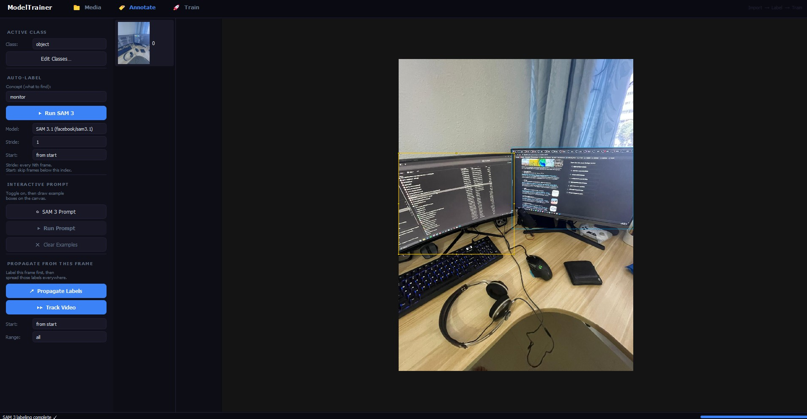

# Model Trainer

A powerful, native desktop application for dataset annotation and computer vision model training. Model Trainer integrates Meta's state-of-the-art **SAM 3** (Segment Anything Model 3) for zero-shot auto-labeling and visual tracking, along with **Ultralytics YOLO** for seamless, localized model training—all within a single, hardware-accelerated GUI.



## Features

### Media Import & Management
* **Flexible Import Modes:** Replace All (fresh start), Add More (append frames), or Import YOLO Dataset (load existing annotations + class names).
* **Video Frame Sampling:** Reduce video import size with adjustable stride (e.g., stride=5 keeps 1 in 5 frames, ~80% fewer files).
* **YOLO Dataset Loader:** Automatically import existing YOLO datasets with class names from `data.yaml` and pre-populated bounding boxes from `labels/*.txt`.

### Annotation & Auto-Labeling
* **Zero-Shot Auto-Labeling:** Leverage SAM 3's text-to-image capabilities to automatically find and bound objects across your entire dataset simply by typing a description (e.g., "car", "solar panel"). Fine-tune with **Start Frame** and **Stride** controls.
* **Propagate Labels:** Extract class names from a manually-labeled seed frame and apply them as search concepts across all other frames. Use **Start Frame** to skip early frames if needed.
* **SAM 3 Video Tracking:** Label a single frame and use SAM 3's temporal memory to visually track and propagate the bounding box across continuous video frames. Auto-warns if frame gaps from stride are too large.
* **Interactive Prompting:** Use point-and-click positive (green) and negative (red) visual hints to interactively guide SAM 3 to segment exact, complex objects.
* **Manual Annotation:** Fast and intuitive manual bounding box drawing with full resize and drag support.

### Training & Export
* **YOLO Dataset Export:** Automatically format and export your labeled frames into standard YOLO format with a generated `data.yaml`.
* **Embedded YOLO Training:** Train YOLOv8, YOLOv11, or YOLO26 models directly inside the application. Features automatic VRAM batch scaling (`batch=-1`), dataset caching, and real-time training progress UI.
* **GPU Acceleration:** Fully utilizes CUDA for blazing fast SAM 3 inference and YOLO training. Diagnostics printed on startup.
* **Multi-GPU Support:** Automatically selects best available device (GPU first, CPU fallback).

## Requirements

* Python 3.10+
* A CUDA-capable NVIDIA GPU is highly recommended for reasonable SAM 3 and YOLO performance.
* Dependencies listed in `requirements.txt`.

## Installation

1. Clone this repository.
2. Create a virtual environment:
   ```bash
   python -m venv venv
   venv\Scripts\activate
   ```
3. Install dependencies:
   ```bash
   pip install -r requirements.txt
   ```
   *(Note: Ensure you install the CUDA version of PyTorch if you are using an NVIDIA GPU for hardware acceleration).*

## Usage

Start the application by running the main entry point:
```bash
python -m app.main
```

### Typical Workflow

#### Option A: Start from Scratch
1. **Import Media:** Use **Replace All Media** to import a folder of images or videos. Adjust **Stride** to skip video frames if needed (e.g., stride=5 for large datasets).
2. **Define Classes:** Use "Edit Classes" in the Annotate tab to add the categories you want to detect (e.g., "drone", "car").
3. **Annotate:**
   - Manually label a representative frame, or use **SAM 3 Prompt** to interactively refine objects on one frame.
   - Use **Propagate Labels** to apply those class names as search concepts across all frames (or just frames after a **Start Frame** index).
   - Alternatively, use **Run SAM 3** with a text concept (e.g., "solar module") to search across all frames.
   - Use **Track Video** to follow labeled objects through continuous video using SAM 3's memory.
4. **Review & Export:** Switch to thumbnails to verify labels, then click **Export YOLO** to write `.txt` files and `data.yaml`.
5. **Train:** Click **Start Training**, pick your exported dataset folder, choose a YOLO model and epoch count, and train on GPU.

#### Option B: Continue an Existing Dataset
1. **Import YOLO Dataset:** Use **Import YOLO Dataset** to load an existing folder with `images/`, `labels/`, and `data.yaml`. Class names and all boxes are auto-loaded.
2. **Refine:** Edit boxes as needed, or use SAM 3 / Propagate to add more annotations.
3. **Re-export & Retrain:** Export updated labels and retrain with the full dataset.

#### Option C: Expand with More Media
1. **Add More Media:** Use **Add More Media** to append images/videos to your current session without clearing existing frames and labels.
2. **Annotate New Frames:** Run SAM 3 or Propagate on the new media using the **Start Frame** control to skip already-labeled frames.

## Key Controls & Parameters

### Media Tab
| Control | Purpose |
|---------|---------|
| **Replace All Media** | Clear everything and import fresh folder of images/videos |
| **Add More Media** | Append images/videos without clearing existing frames |
| **Import YOLO Dataset** | Load a folder with `images/`, `labels/`, `data.yaml` (auto-loads class names and bboxes) |
| **Stride** | Video frame sampling: keep 1 in every N raw frames (1 = every frame, 5 = ~80% fewer frames) |

### Annotate Tab
| Control | Purpose |
|---------|---------|
| **Run SAM 3** | Auto-label frames using a text concept (e.g., "solar panel"). Searches all frames matching Stride & Start Frame. |
| **Model** | SAM 3 version (SAM 3.1 recommended for best quality) |
| **Stride** | Run SAM on every Nth imported frame |
| **Start** (SAM 3) | First frame index to process (0 = from start; 50 = skip frames 0–49) |
| **Propagate Labels** | Extract class names from current frame's boxes and search for them across all other frames |
| **Start** (Propagate) | First frame to propagate to (excludes seed frame always) |
| **Track Video** | Follow labeled objects through video using SAM 3's temporal memory (requires consecutive frames) |
| **Range** | Max frames to track forward from seed frame (0 = entire video) |

### Train Tab
| Control | Purpose |
|---------|---------|
| **Export YOLO** | Write frames + `labels/*.txt` + `data.yaml` to a folder |
| **Model** | YOLO architecture (YOLOv8n/s/m/l, YOLO11n/s/m/l, YOLO26n/s/m/l) |
| **Epochs** | Training epochs |
| **Start Training** | Point to exported dataset folder and begin training |

## Diagnostics

On startup, the console prints:
```
PyTorch version: X.X.X
Is CUDA available? True/False
Current CUDA device ID: 0
GPU Device Name: NVIDIA GeForce RTX 3070
Total GPU Memory: 8.00 GB
```

If `CUDA available? False`, both SAM 3 and YOLO will run on CPU (much slower). Install the CUDA version of PyTorch for GPU acceleration.

## Architecture

* **UI Layer:** PyQt/PySide6
* **Inference Layer:** Hugging Face `transformers` (SAM 3, SAM 3 Video Tracker)
* **Training Layer:** `ultralytics` YOLO API

## License

MIT License
