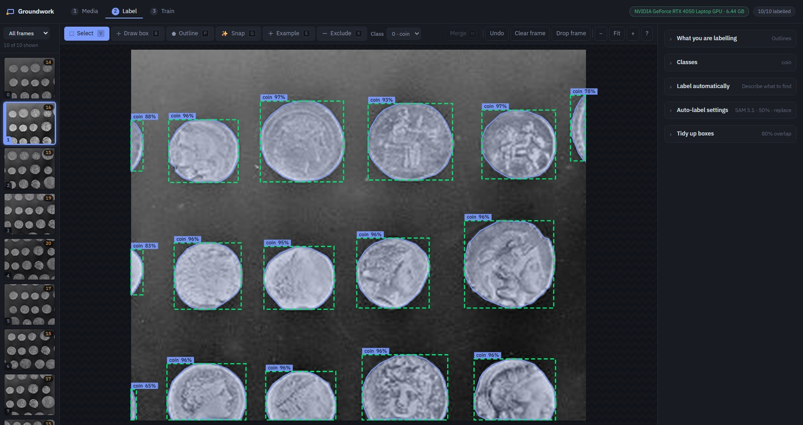
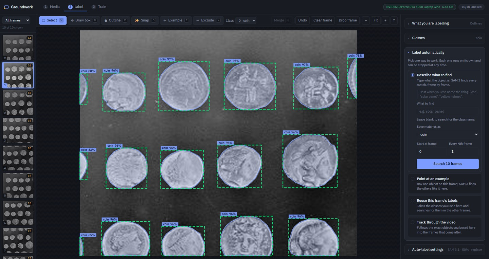
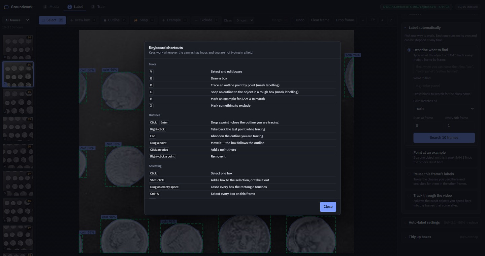
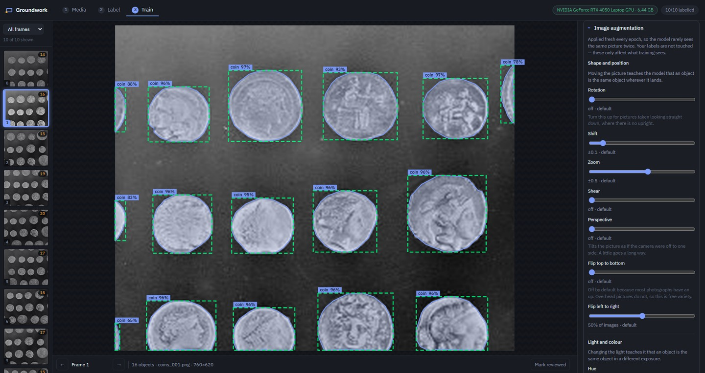

# Groundwork

Label datasets and train computer-vision models from your browser.

Groundwork runs a small server on your own machine and serves its interface to
`localhost` — your images, labels and GPU never leave the computer. It wraps Meta's
**SAM 3** for zero-shot auto-labelling and **Ultralytics YOLO** for training, export and
ONNX conversion, so a large model does the tedious part and a small fast one is trained
from the result.



<sub>Screenshots use the public-domain `coins` sample from scikit-image — the outlines in
them were produced by typing "coin" into *Describe what to find* and letting it run.</sub>

## Install and run

Python 3.10+ and, for anything other than a demo, a CUDA-capable NVIDIA GPU.

```bash
python -m venv venv
venv\Scripts\activate
pip install -r requirements.txt
```

*(Install the CUDA build of PyTorch if you have an NVIDIA GPU — the default wheel is CPU-only.)*

```bash
python -m app.main
```

The server starts and opens `http://localhost:8321` in your browser. Useful flags:

| Flag | What it does |
|------|--------------|
| `--port 9000` | Serve on a different port (a busy port is skipped automatically) |
| `--host 0.0.0.0` | Reachable from other machines on your network — only on networks you trust |
| `--no-browser` | Start the server without opening a browser window |

Your session is written to `.groundwork/session/` as you work and comes back when you
reopen the app, so closing the tab or restarting the server costs you nothing. Frames are
found by name inside that folder rather than by the path they were imported from, so the
project directory can be renamed or moved without losing them.

Press `Ctrl+C` in the terminal to stop the server. It finishes what it is doing, saves the
session and exits.

## The workflow

The interface has three steps across the top, and you move through them in order.

### 1 · Media

| Action | What it does |
|--------|--------------|
| **Import images or video** | Clears the session and imports a folder. If it happens to be a YOLO dataset, the labels and class names come with it. |
| **Add more to what is loaded** | Appends another folder without touching existing frames. |
| **Open an existing YOLO dataset** | Loads `images/` + `labels/` + `data.yaml`, including detection, segmentation and pose labels. |
| **Keep 1 frame in every N** | Video sampling. 5 keeps one frame in five — far fewer files to label. Tracking needs 1. |

Browse buttons open the ordinary Windows file dialog — the same Explorer window with
the address bar, Quick access and search that every other app uses. It opens in its own
window, so if it does not appear, look behind the browser.

A built-in folder browser is there as a fallback, and the app switches to it by itself
when a Windows dialog cannot be shown — which is what happens if you open Groundwork
from another computer, since the dialog would otherwise appear on the server's screen.
You can also switch to it permanently with **Use the Windows file dialog** in the Media
step, or for one pick with the button on the waiting window.

### 2 · Label

The centre pane is the editor; the right panel holds the labelling tools, each section
folded away until you need it. A folded section still shows what it is set to.



**Label automatically** offers four named methods. Only one is open at a time, each says
what it does and when to use it, and each has a single button that starts it.

| Method | What it does | Reach for it when |
|--------|--------------|-------------------|
| **Describe what to find** | Type a phrase; SAM 3 finds every match in each frame | The object has a name you can type — "car", "solar panel" |
| **Point at an example** | Drag a box around one object; SAM 3 finds the others **on that frame** | The object is hard to name, or a description brings back the wrong things |
| **Reuse this frame's labels** | Turns the classes on this frame into search terms for all the other frames | Photo sets and changing scenes, where each frame stands alone |
| **Track through the video** | Follows the exact objects you boxed into the frames that follow | Continuous video of the same moving objects (import at stride 1) |

**What you are labelling** sits at the top of the panel — *Boxes*, *Outlines* or *Corner
points*. It decides which tools you get, what auto-labelling records, and the format
Export writes, so it is the one switch to set before you start.

Three settings sit under the methods and apply to all of them:

* **Model** — SAM 3.1 (recommended) or SAM 3.
* **Confidence** — lower finds more objects and more mistakes; higher keeps only sure matches.
* **If a frame already has labels** — *Replace them*, *Keep them and add*, or *Leave that
  frame alone*. A run that finds nothing never erases what is already on a frame.

#### Editing by hand

Press `?` in the app for this list at any time; the tool buttons carry their key too.



| Keys | |
|------|--|
| `V` `B` `E` `X` | Select · Draw box · Example · Exclude |
| `P` · `G` | Trace an outline · snap one to an object (when labelling outlines) |
| Click · `Shift`-click | Select a box · add it to the selection, or take it out |
| Drag on empty space | Lasso every box the rectangle touches |
| `Ctrl+A` · `Esc` | Select every box on the frame · select nothing |
| `M` | **Merge the selected boxes into one** |
| `Delete` | Remove the selected boxes |
| `0`–`9` | Put the selected boxes in that class |
| `Ctrl+Z` | Undo on the current frame |
| `←` `→` · `Shift`+`←` `→` | Previous / next frame · extend the frame selection |
| Wheel · `Space`-drag, middle-drag or `Alt`-drag | Zoom · pan |
| `F` · `Ctrl+S` | Fit the image to the window · save the session now |

Dragging a box moves the whole selection, so several boxes can be nudged at once.
Resize handles appear only when a single box is selected.

#### Working on several frames

The filmstrip selects like a file list: click opens a frame, `Shift`-click takes
everything between it and the current one, `Ctrl`-click adds or removes one, and
`Shift`+arrow extends the run. Selected frames are tinted blue, and the frame you are
looking at carries a bright border, an edge bar and a highlighted number.

**Clear frames** and **Drop frames** then act on the whole selection and say how many they
will touch. Clearing a single frame stays undoable in the editor; clearing several asks
first, because it cannot be undone. Dropping frames removes them from the session only —
the original files on disk are untouched.

Boxes are coloured by class. A **dashed** line means SAM suggested it and nobody has
looked yet; a **solid** one means a human drew or adjusted it. When an object carries an
outline, the rectangle around it is drawn **green** — the outline keeps the class colour,
so the shape and the box that wraps it never read as one line. Pose keypoints show as
numbered corner dots — drag to move, right-click to remove, right-click a ghost to bring
it back. **Mark reviewed** records that you have checked a frame, which the exporter can
then filter on.

#### Outlines (segmentation)

Set **What you are labelling** to *Outlines* and two more tools appear:

| Tool | |
|------|--|
| **Snap** (`G`) | Drag a rough box around one object; SAM fits the outline to what is inside it. The box only has to be close — the outline lands on the object. |
| **Outline** (`P`) | Trace by hand, point by point. Click the first point or press `Enter` to close, right-click to take back a point, `Esc` to abandon it. |

Every auto-label method records outlines too, at no extra cost — SAM computes a mask for
each object it finds either way, so *Describe what to find*, *Reuse this frame's labels*
and *Track through the video* all produce real shapes rather than rectangles.

Select an outline and its points appear. Drag a point to move it, click an edge to add
one, right-click a point to remove it. The bounding box follows the outline, so it is
always correct. **Outline detail** controls how closely a shape follows the mask —
*Coarse* collapses a panel to its four corners, *Fine* keeps every wobble. Fewer points
mean smaller labels and faster training, so prefer the coarsest setting that still traces
the object.

Snapping is fast because nearly all of its cost is reading the picture, and that only has
to happen once per frame. Selecting the Snap tool or opening a frame starts that read in
the background, so by the time a box is drawn the answer is usually already a tenth of a
second away; every further object on the same frame is quicker still. Moving to another
frame starts again — the app keeps one frame ready, not all of them.

Export writes standard YOLO segmentation labels: one polygon per object. That means one
outline per object — a shape with a hole, or one that breaks into pieces, keeps its
largest part. **Boxes → masks** in the Train step is still there for datasets labelled
elsewhere, but you no longer need it for anything labelled here.

#### Merging boxes

Auto-labelling often leaves two or three boxes stacked on the same object, and one
object sometimes comes back as several pieces. Both have a fix:

* **By hand** — select the boxes (lasso them, or `Shift`-click) and press `M`. The
  result covers all of them, takes the class most of them agreed on, and counts as
  hand-made. `Ctrl+Z` puts them back.
* **In bulk** — **Tidy up boxes** in the Label panel folds overlapping boxes together
  on this frame or across every frame. Two boxes join when the chosen percentage of
  the smaller one sits inside the bigger one, and joining is transitive, so a pile of
  duplicates collapses in one pass. Boxes of different classes are left alone unless
  you say otherwise.

When merged boxes carry masks, the new outline is the convex hull of the originals, so
nothing is clipped. Pose keypoints become the four corners of the merged box.

### 3 · Train

| Action | What it does |
|--------|--------------|
| **Export a dataset** | Writes `images/`, `labels/` and `data.yaml` for detection, segmentation or pose |
| **Train a model** | YOLOv8 / 11 / 12 / 26, FastSAM or SAM 2 fine-tuning, with training settings and image augmentation each behind their own section |
| **Boxes → masks** | Upgrades a detection dataset that was labelled elsewhere to polygon masks using SAM 3 |
| **Masks → 4 corner points** | Converts polygons to pose keypoints geometrically; no model, seconds to run |
| **Export to ONNX** | Converts a trained `.pt` to ONNX at FP32 or FP16, dynamic or static shape |

Training warns you before starting if the model and the dataset disagree — a pose model
against a detection dataset, for instance — and lets you go ahead anyway.

#### Image augmentation



Training distorts every picture before the model sees it — a shift in brightness, a flip,
a crop, four images stitched into one — so that a few dozen labelled frames stretch much
further than a few dozen. This happens on every epoch, and it happened before there was a
panel for it; **Image augmentation** only makes the settings visible and changeable.

Each slider says what its number means rather than showing a bare figure, and the section
header says how many have been moved off their default. Your labels are never touched:
augmentation only affects what training sees.

Two are worth knowing about for overhead imagery, where there is no "up":

- **Flip top to bottom** is off by default, because most photographs have an upright.
  Pictures taken looking straight down do not, so turning it on is free variety.
- **Rotation** is likewise off. The same argument applies.

Hue and saturation only do something to colour images — on greyscale they move nothing,
whatever they are set to.

## Every long job can be stopped

Imports, auto-labelling, tracking, conversions and training all run as background jobs.
A bar at the bottom of the window shows what is running, how far along it is, and a
**Stop** button. Stopping keeps everything finished so far: imported frames stay, labels
already written stay, and a stopped training run keeps its best checkpoint. (ONNX export
is the one exception — it says so, because the converter cannot be interrupted safely.)

## Where files go

| Path | Contents |
|------|----------|
| `.groundwork/session/` | The current session: decoded frames, thumbnails, `session.json` |
| `runs/train/exp/weights/` | Training checkpoints — `best.pt` and `last.pt` |
| `runs/export/` | ONNX files exported from checkpoints outside the project |
| `weights/` | Pretrained weights downloaded by Ultralytics |

Ultralytics is repointed at the project root on startup, so nothing is scattered into
global directories elsewhere on your machine.

## How it fits together

```
app/
  main.py            entry point — starts uvicorn, opens the browser
  core/              Qt-free engine
    session.py         the session: frames, classes, models, jobs
    jobs.py            background jobs with progress and cancellation
    boxops.py          merging boxes, by hand and by overlap
    maskops.py         SAM masks → the outlines a seg label needs
    media_loader.py    images and video → frames
    sam3_handler.py    SAM 3 concept segmentation and video tracking
    yolo_trainer.py    Ultralytics training (stoppable mid-run) and its augmentation settings
    sam2_trainer.py    SAM 2 fine-tuning
    yolo_seg_converter.py / yolo_pose_converter.py
    onnx_exporter.py
  server/            FastAPI routes, websocket event bus
    api.py             every route; long work is handed to core/jobs.py
    nativedialog.py    the Windows Explorer file dialog, via IFileOpenDialog
    fsbrowse.py        the built-in folder browser used as a fallback
  web/               the interface — plain HTML, CSS and ES modules, no build step
  utils/             YOLO dataset writer
docs/                the screenshots in this file
```

Nothing in `core/` knows about HTTP, so the engine is equally usable from a script.

## Troubleshooting

**"CPU only" in the top-right.** PyTorch cannot see your GPU. SAM 3 and training still
work but are much slower. Install the CUDA build of PyTorch.

**The first SAM 3 run takes a minute.** The model is downloaded once and then loaded into
VRAM; later runs in the same session reuse it.

**Tracking loses objects.** The tracker follows objects between neighbouring frames. If
the video was imported keeping 1 frame in 5, objects jump too far between frames — the
app warns you. Re-import at stride 1, or use *Reuse this frame's labels* instead.

**Training runs out of memory.** Set **Image cache** to *Off* and lower **Loader workers**.
Batch size is chosen automatically from free VRAM.

**Upgrading from when this was called ModelTrainer.** Nothing to do. An old
`.modeltrainer/session/` folder is moved to `.groundwork/session/` the first time the app
starts, labels and all, and your saved interface settings carry across too.

## License

MIT License
