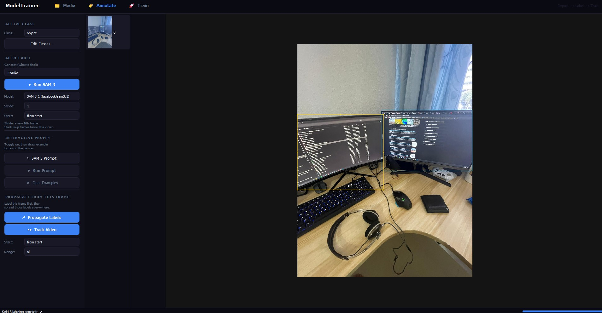

# Model Trainer

Label datasets and train computer-vision models from your browser. Model Trainer runs a
small local server on your own machine and serves its interface to `localhost` — your
images, labels and GPU never leave the computer. It wraps Meta's **SAM 3** for zero-shot
auto-labelling and **Ultralytics YOLO** for training, export and ONNX conversion.



## Install and run

Python 3.10+ and, for anything other than a demo, a CUDA-capable NVIDIA GPU.

```bash
python -m venv venv
venv\Scripts\activate
pip install -r requirements.txt
```

*(Install the CUDA build of PyTorch if you have an NVIDIA GPU — the default wheel is CPU-only.)*

```bash
python -m app.main
```

The server starts and opens `http://localhost:8321` in your browser. Useful flags:

| Flag | What it does |
|------|--------------|
| `--port 9000` | Serve on a different port (a busy port is skipped automatically) |
| `--host 0.0.0.0` | Reachable from other machines on your network — only on networks you trust |
| `--no-browser` | Start the server without opening a browser window |

Your session is written to `.modeltrainer/session/` as you work and comes back when you
reopen the app, so closing the tab or restarting the server costs you nothing.

## The workflow

The interface has three steps across the top, and you move through them in order.

### 1 · Media

| Action | What it does |
|--------|--------------|
| **Import images or video** | Clears the session and imports a folder. If it happens to be a YOLO dataset, the labels and class names come with it. |
| **Add more to what is loaded** | Appends another folder without touching existing frames. |
| **Open an existing YOLO dataset** | Loads `images/` + `labels/` + `data.yaml`, including detection, segmentation and pose labels. |
| **Keep 1 frame in every N** | Video sampling. 5 keeps one frame in five — far fewer files to label. Tracking needs 1. |

Browse buttons open the ordinary Windows file dialog — the same Explorer window with
the address bar, Quick access and search that every other app uses. It opens in its own
window, so if it does not appear, look behind the browser.

A built-in folder browser is there as a fallback, and the app switches to it by itself
when a Windows dialog cannot be shown — which is what happens if you open ModelTrainer
from another computer, since the dialog would otherwise appear on the server's screen.
You can also switch to it permanently with **Use the Windows file dialog** in the Media
step, or for one pick with the button on the waiting window.

### 2 · Label

The centre pane is the editor; the right panel holds one **Auto-label** section with four
named methods. Only one is open at a time, each says what it does and when to use it, and
each has a single button that starts it.

| Method | What it does | Reach for it when |
|--------|--------------|-------------------|
| **Describe what to find** | Type a phrase; SAM 3 finds every match in each frame | The object has a name you can type — "car", "solar panel" |
| **Point at an example** | Drag a box around one object; SAM 3 finds the others **on that frame** | The object is hard to name, or a description brings back the wrong things |
| **Reuse this frame's labels** | Turns the classes on this frame into search terms for all the other frames | Photo sets and changing scenes, where each frame stands alone |
| **Track through the video** | Follows the exact objects you boxed into the frames that follow | Continuous video of the same moving objects (import at stride 1) |

Three settings sit under the methods and apply to all of them:

* **Model** — SAM 3.1 (recommended) or SAM 3.
* **Confidence** — lower finds more objects and more mistakes; higher keeps only sure matches.
* **If a frame already has labels** — *Replace them*, *Keep them and add*, or *Leave that
  frame alone*. A run that finds nothing never erases what is already on a frame.

#### Editing by hand

| Control | |
|---------|--|
| **Select** (`V`) | Click a box to select, drag to move, drag a handle to resize |
| **Draw box** (`B`) | Drag on the image to add a box in the active class |
| **Example** (`E`) / **Exclude** (`X`) | Green and red example boxes for *Point at an example* |
| `←` `→` | Previous / next frame |
| `Delete` | Remove the selected box |
| `0`–`9` | Switch the active class (also changes the selected box) |
| `Ctrl+Z` | Undo on the current frame |
| `F` | Fit the image to the window |
| Wheel / `Shift`-drag | Zoom / pan |
| `Ctrl+S` | Save the session now (it also saves itself) |

Boxes are coloured by class. A **dashed** outline means SAM suggested it and nobody has
looked yet; a **solid** one means a human drew or adjusted it. Pose keypoints show as
numbered corner dots — drag to move, right-click to remove, right-click a ghost to bring
it back. **Mark reviewed** records that you have checked a frame, which the exporter can
then filter on.

### 3 · Train

| Action | What it does |
|--------|--------------|
| **Export a dataset** | Writes `images/`, `labels/` and `data.yaml` for detection, segmentation or pose |
| **Train a model** | YOLOv8 / 11 / 12 / 26, FastSAM or SAM 2 fine-tuning, with image size, cache mode and worker count exposed |
| **Boxes → masks** | Upgrades a detection dataset to polygon masks using SAM 3 — no re-labelling |
| **Masks → 4 corner points** | Converts polygons to pose keypoints geometrically; no model, seconds to run |
| **Export to ONNX** | Converts a trained `.pt` to ONNX at FP32 or FP16, dynamic or static shape |

Training warns you before starting if the model and the dataset disagree — a pose model
against a detection dataset, for instance — and lets you go ahead anyway.

## Every long job can be stopped

Imports, auto-labelling, tracking, conversions and training all run as background jobs.
A bar at the bottom of the window shows what is running, how far along it is, and a
**Stop** button. Stopping keeps everything finished so far: imported frames stay, labels
already written stay, and a stopped training run keeps its best checkpoint. (ONNX export
is the one exception — it says so, because the converter cannot be interrupted safely.)

## Where files go

| Path | Contents |
|------|----------|
| `.modeltrainer/session/` | The current session: decoded frames, thumbnails, `session.json` |
| `runs/train/exp/weights/` | Training checkpoints — `best.pt` and `last.pt` |
| `runs/export/` | ONNX files exported from checkpoints outside the project |
| `weights/` | Pretrained weights downloaded by Ultralytics |

Ultralytics is repointed at the project root on startup, so nothing is scattered into
global directories elsewhere on your machine.

## How it fits together

```
app/
  main.py            entry point — starts uvicorn, opens the browser
  core/              Qt-free engine
    session.py         the session: frames, classes, models, jobs
    jobs.py            background jobs with progress and cancellation
    media_loader.py    images and video → frames
    sam3_handler.py    SAM 3 concept segmentation and video tracking
    yolo_trainer.py    Ultralytics training (stoppable mid-run)
    sam2_trainer.py    SAM 2 fine-tuning
    yolo_seg_converter.py / yolo_pose_converter.py
    onnx_exporter.py
  server/            FastAPI routes, websocket event bus
    api.py             every route; long work is handed to core/jobs.py
    nativedialog.py    the Windows Explorer file dialog, via IFileOpenDialog
    fsbrowse.py        the built-in folder browser used as a fallback
  web/               the interface — plain HTML, CSS and ES modules, no build step
  utils/             YOLO dataset writer
```

Nothing in `core/` knows about HTTP, so the engine is equally usable from a script.

## Troubleshooting

**"CPU only" in the top-right.** PyTorch cannot see your GPU. SAM 3 and training still
work but are much slower. Install the CUDA build of PyTorch.

**The first SAM 3 run takes a minute.** The model is downloaded once and then loaded into
VRAM; later runs in the same session reuse it.

**Tracking loses objects.** The tracker follows objects between neighbouring frames. If
the video was imported keeping 1 frame in 5, objects jump too far between frames — the
app warns you. Re-import at stride 1, or use *Reuse this frame's labels* instead.

**Training runs out of memory.** Set **Image cache** to *Off* and lower **Loader workers**.
Batch size is chosen automatically from free VRAM.

## License

MIT License
